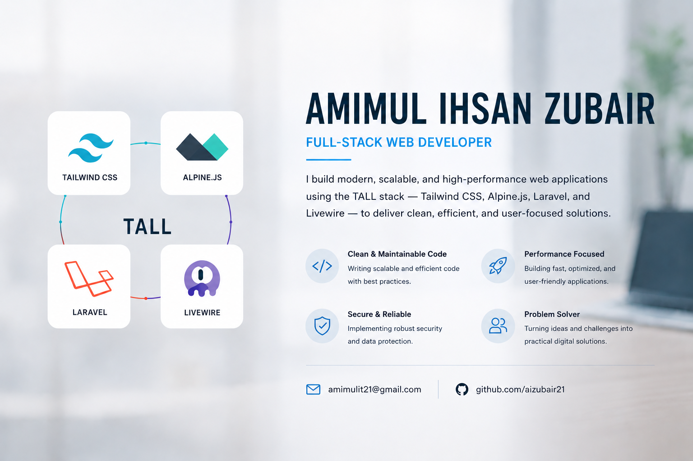

    

# AMIMUL IHSAN ZUBAIR

**Full-Stack Web Developer | Laravel & Nuxt.js Specialist**

I am a Full-Stack Web Developer with experience designing, developing, and deploying scalable web applications, RESTful APIs, business management systems, and multi-vendor eCommerce platforms. My primary focus is building secure, maintainable, and performance-driven applications using modern PHP and JavaScript technologies.

---

## 🚀 Core Expertise

* Full-Stack Web Application Development
* Laravel Application Architecture
* Nuxt.js & Vue.js Single Page Applications (SPA)
* RESTful API Design & Integration
* Authentication & Authorization Systems
* Role-Based Access Control (RBAC)
* Multi-Vendor eCommerce Solutions
* Referral & Commission-Based Systems
* Database Design & Optimization
* Linux Server Administration
* CI/CD & Deployment Automation
* Laravel Subscription Management
* Custom Admin Panel with RBAC Setup

---

## 🛠 Technology Stack

### Backend

* PHP
* Laravel
* Laravel Livewire
* REST APIs
* MVC Architecture

### Frontend

* Laravel Blade Templating
* Vue.js
* Nuxt.js
* JavaScript (ES6+)
* Alpine.js
* Tailwind CSS
* Bootstrap
* HTML5 & CSS3

### Database

* MySQL

### Version Control

* Git & GitHub

### Testing & Debugging

* PHPUnit

### Deployment & Hosting

* Linux VPS
* Nginx / Apache
* Docker
* CI/CD Pipelines
* Cloud Hosting (DigitalOcean, AWS, etc.)
* cPanel / Plesk Management

### Editors & IDEs

* Visual Studio Code
* PhpStorm
* Sublime Text
* JetBrains IDEs
* Postman for API Testing
* Browser Developer Tools
* Figma / Adobe XD for UI/UX Design

### Infrastructure & DevOps

* Linux
* VPS Management
* Git & GitHub
* CI/CD Pipelines

### Additional Tools

* WordPress
* Google Workspace
* Microsoft Office
* Adobe Photoshop
* Illustrator / Inkscape

---

## 💼 Notable Project Experience

### Multi-Vendor eCommerce Platform

Designed and developed a feature-rich eCommerce ecosystem supporting multiple user roles and commission structures.

**Key Features:**

* User, Vendor, Reseller, Rider, and Super Admin accounts
* Role-Based Access Control (RBAC)
* Referral and affiliate commission system
* VIP subscription and rewards program
* Multi-party commission distribution
* Automated payout calculations
* Order, inventory, and vendor management
* Responsive administration dashboard

### Business Management Solutions

Built custom management systems tailored for business operations, including:

* Customer Relationship Management (CRM)
* Inventory Management
* Reporting & Analytics
* Employee Access Management
* Operational Workflow Automation

### REST API Development

Developed secure and scalable APIs for web and mobile applications with:

* Token-based authentication
* User authorization and permissions
* Third-party service integration
* Structured API documentation
* Performance-focused architecture

---

## 📈 Professional Goals

I am currently focused on advancing my expertise in:

* Large-Scale Laravel Applications
* System Design & Software Architecture
* High-Performance API Development
* Cloud & Linux Infrastructure
* Modern Nuxt.js Ecosystem
* Scalable SaaS Platforms

---

<!-- ## 📊 GitHub Statistics -->

<!-- Add GitHub Stats Widgets Here -->

## 📫 Contact

* GitHub: https://github.com/aizubair21
* LinkedIn: https://linkedin.com/in/amimul
* Email: [amimulit21@gmail.com](mailto:amimulit21@gmail.com)
<!-- * Portfolio: https://your-portfolio.com -->
