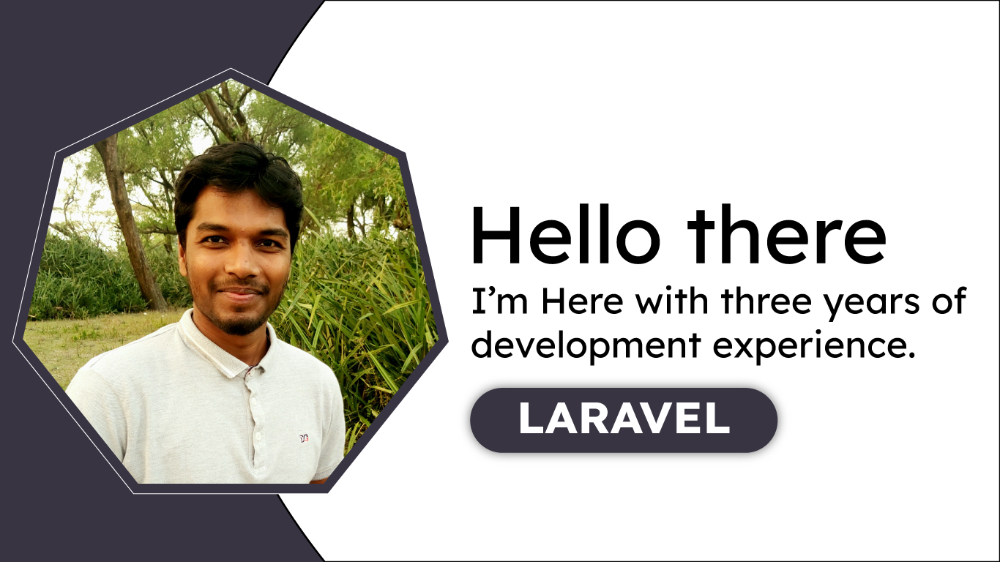

<p align="center">
    
</p>

<p align="center">
    
    
    
    
    
</p>

# Hello, there 🙋‍♂️
- 👋 I'm <b>AMIMUL IHSAN ZUBAIR</b> as a PHP/Laravel web developer from Bangladesh.
- 👀 I'm interested to learn new thing everyday. and do some different jobs. that's not done yet.
- 🌱 I'm currently pass my time through learning web development. Currently I'm  learning "Laravel" a PHP Framework. with 'Vue.js' for SPA.

# Connect with me 📌

# Soft Skills:

- ## FULL-STACK WEB DEVELOPMENT :
    <p> A full stack web developer is a professional who possesses the skills and knowledge to develop both the <b></b>cliet-side</b> and     <b>server-side</b> coponents of a web applicaiton. They are proficient in various technologies and programming languages required for     front-end and back-end development</p>

- ## Front-End Development :
    - Aa a full stack web developer I have well-versed in front-end technologies such as HTML, CSS and JavaScript.
    - I have expertise in creating and designing use interfaces, ensuring a semless user experience.
    - I have skilled in using frameworks and liveries like <b> Reack </b> and <b> VueJs </b>. But, Personally I use VueJs as for SPA applications to build interactive and dynamic web pages.
    - Additionally, I'm skilled to design and develop responsive web pages.
    - ### Front-End Techlogolies:
        - HTML - Markup language
            ```HTML
            <!DOCTYPE html>
            <html lang="en">
            <head>
                <meta charset="UTF-8">
                <meta name="viewport" content="width=device-width, initial-scale=1.0">
                <title>Markup Language</title>
            </head>
            <body>
                
            </body>
            </html>```
        - CSS - Style
          ``` CSS
          body {
            margin:0;
            padding:0;
            overflow:hidden;
            line-height:25px;
          }
        - JavaScript for User Interaction
          ``` JavaScript
          <script>
          var targetElement = document.querrySelector(".targetElement");
          targetElement.forEach((elm, index)=>{
              elm.addEventListener("input", (e)=>{
                  console.log(e.value);
              })
          );
          </script> 
        - Less (CSS prepocessor)
          ```less
          body{
              .icon{
                  border-radius:50%;
                  width:100px;
                  height:100px;
                  display:flex;
                  justify-content:center;
                  align-items:center;
                  
                    .inner{
                          border-radius:50%;
                          width:80px;
                          height:80px;
                          
                      }
              }
          }
        - <b>Jquery</b> Jquery usable for DOM Manipulation. But, I cetisfied with vanila JavaScript by using Modern JavaScript like ES6 syntex.  (If i use Vue.Js Jquery not needed)

          <details>
              <summary>Example of Jquery</summary>

          ```JavaScript
          //have an array DOM, like this
          var dom_element = document.getElementsByClassName("dom_element");

          /**
          * we aware to assign an 'click' event listener each dom element when clicked.
          * with Jquery, done as like this
          */
          $(".dom_element").on("click", funciton(e){
            console.log(e);
          })

          /**
          * But, with vanila js. we have to loop through every dom_element array. then add 'click' listener one by one.
          * bellow example with ES6 syntex
          */
          do_element.forEach((d_elm, index)=>{
              d_elm.addEventListener("click", function(e){
                console.log(e);
              })
          })

          /**
          * if we aware to do with vanila JavaScript.
          * We have to loop throuth do_element with forloop.
          * sometimes a DOM array make with 'getElementsByClassName' not working with ES6 syntax. then use this technique
          */

          for(var i = 0, i < dom_element.length-1, i++){
          /**
            * when i is o. we get first array element by dom_element[i]. it continued till the last element of array. we get one by one array element
          */
            dom_element[i].addEventListener('click', function(e){
                    console.log(e);
              });
          }
        </details>
     - <b>Vue.Js</b> : use vueJs as my front-end reactive library for SPA application.
       ```JavaScript
       //'script.js'
       import {createApp} from 'vue';
       const app = New Vue({
            el:"#app";
           data() {
              return:{
                    message:"This is vue application";
               } 
           }
       });
     - 
- ## Back-End Development :
    As a full stack web developer, I'm skilled and knowledegeable in server-side programming languages like PHP Node.Js Python Ruby.
    - ### Back-End Language :
        </b> I personally use <b>PHP</b> as my personal Back-End language for hangle data storage and retrieval.
      ```php
      <?php
      $name = "PHP";
        echo ("PHP is a server-side language! ");
      
    - ### Back-End Framework :
       </b> I skilled of using back-end frameword laravel. well known with laravel MVC pattern. experienced laravel - 
        - Routing
        - Middleware
        - Controller
        - Fachades
        - Eluquent ORM
        - Request Lifecycle
        - Blade Template
        - Artisan Console
        - Queues
        - Authertication
        - Authorization
        - Email Varificaiton
        - Seeding
        - Query Builder
        - Mutator / Casts
        - Livewire
        - Breeze
        - Sanctum
        - API etc...
      
        <details>
          <summary>PHP Laravel Example - </summary>
            

      ```php 
            <?php

            namespace App\Http\Controllers\admin;
            
            use App\Http\Controllers\Controller;
            use App\Models\client_message;
            // use App\Models\landBusiness;
            use Illuminate\Http\Request;
            use Illuminate\Support\Facades\DB;
            use App\Models\project;
            use App\Models\project_category;
            use Illuminate\Support\Str;
            // use App\Models\project_image;
            use App\Models\readyFlat;
            use App\Models\User;
            // use FontLib\Table\Type\name;
            use Illuminate\Support\Facades\Auth;
            use Illuminate\Validation\Rule;
            // use App\Notifications\ResetPasswordNotification;
            use Illuminate\Support\Facades\Hash;
            use Illuminate\Validation\Rules;
            
            class adminController extends Controller
            {
                //project control index
                public function projectIndex(Request $req)
                {
                    return view('pages.back-end.project.index');
                }
                public function projectIndexByAjax()
                {
                    // $projCategory = project_category::all();
                    // $projectsAll = project::all();
            
                    $projectsAll = DB::table('projects')
                        ->select(
                            "projects.*",
                            "conditional-filters.b_name as filter_name",
                            "project_categories.b_name as category_name",
                        )
                        ->leftJoin("conditional-filters", "projects.status", "conditional-filters.id")
                        ->leftJoin("project_categories", "projects.category", "project_categories.id")
                        ->get();
                    // return $projectsAll;
                    return view("pages.back-end.project.indexAjax", compact("projectsAll"));
                }
            
    
            </details>
    - ### Back-End Server:
        - I have skilled working with MySQL database. But, with Laravel <b>Eluquest ORM </b> Model PostgreSQL easily be handeled.

    - ### SPA Application
      I managed SPA Application using vue with laravel under the InertiaJs echosystem. Inertia gives us use Laravel Back manage and Front end with Vue components. Have some fachilities to use all of laravel features, inclulding
      - Laravel `Routing` system instead of vue routing. All routing and SPA techinique manageged by `InertiaJs`.
      - Laravel `Controller`.
      - Laravel `Middlewere`.
      - Laravel default `Authentication` system with sanctum API token.
      - Full Back-End support of Laravel.

# Academic Educational :

- ## BA `2023` -
    I passed my Bachelor of Arts form `Govement University` under the Department of <b> Islamic Studies.
- ## HSC `2018` -
    I passed my HSC from `Madrasha Educational Board` with a great GPA - 5.00.
- ## SSC `2016` -
    I passed my SSC also `Madrasha Educational Board` with GPA - 5.00.

# Development Education :
<p>My Development educaiton startd by own learning HTML, CSS and basica JS from w3schools. <b> ICT Village </b> is mentionable learnign platform, there efforts make me a developer. </p>


<!---
aizubair21/aizubair21 is a ✨ special ✨ repository because its `README.md` (this file) appears on your GitHub profile.
You can click the Preview link to take a look at your changes.
--->
