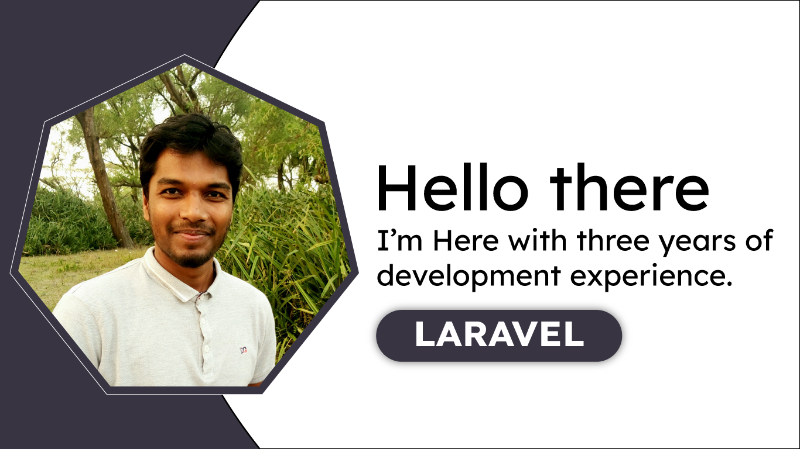

    

# Hay, What'sup 🙋‍♂️
- 👋 I'm <b>AMIMUL IHSAN ZUBAIR</b> as a PHP/Laravel web developer from Bangladesh a learner and wordpress expert.
- 👀 I'm interested to learn new thing everyday. and do some different jobs. that's not done yet.
- 🌱 I'm currently pass my time through learning web development. Currently I'm  learning "Laravel" a PHP Framework. with 'Vue.js' for SPA.

# LIVE PROJECTS 
<table>
    <thead>
        <tr>
            <td>Name</td>
            <td>Description</td>
            <td>Using Technology</td>
        </tr>
    </thead>
    <tbody>
        <tr>
            <td>
                <a href="href://somorponbuilders.com">SOMORPON BUILDERS</a>
            </td>
            <td>
                somorpon builders is a real state company. use website to Display there projects and purposes. also use back-end to manage their office, employee, salary and projects status. as well as daily task of somorponbuildersltd. 
            </td>
            <td>
                Made with laravel.
            </td>
        </tr>
    </tbody>
</table>

# OFFLINE PROJECTS
<table>
    <thead>
        <tr>
            <th>Name</th>
            <th >Description</th>
            <th>Using Technology</th>
        </tr>
    </thead>
    <tbody>
        <tr>
            <td > Weather API </td>
            <td>  </td>
            <td> HTML,CSS,JAVASCRIPT,OPENWEATHERAPI </td>
        </tr>
        <tr>
            <td > Student Manage with Online Exam System </td>
            <td> A full featured student management system application with laravel also have an online exam system (MCQ and Writter). full featured MCQ exam application.
            </td>
            <td> HTML,CSS,JAVASCRIPT, LARAVEL </td>
        </tr>
        <tr>
            <td > Password Generator </td>
            <td> 
                A project to generate strong password with vanila javascript.
            </td>
            <td> HTML,CSS,JAVASCRIPT </td>
        </tr>
         <tr>
            <td > MCQ Template </td>
            <td>
                A template for online MCQ Application.
            </td>
            <td> HTML,CSS,JAVASCRIPT </td>
        </tr>
    </tbody>
</table>

# SOFT SKILLS 💪

- ## Full-Stack Web Development 
    
 A full stack web developer is a professional who possesses the skills and knowledge to develop both the <b></b>cliet-side</b> and     <b>server-side</b> coponents of a web applicaiton. They are proficient in various technologies and programming languages required for     front-end and back-end development

- ## Front-End Development 
    - Aa a full stack web developer I have well-versed in front-end technologies such as HTML, CSS and JavaScript.
    - I have expertise in creating and designing use interfaces, ensuring a semless user experience.
    - I have skilled in using frameworks and liveries like <b> Reack </b> and <b> VueJs </b>. But, Personally I use VueJs as for SPA applications to build interactive and dynamic web pages.
    - Additionally, I'm skilled to design and develop responsive web pages.
    - ### Front-End Techlogolies
        - HTML - Markup language
        - CSS - Style
        - JavaScript for User Interaction
        - Less (CSS prepocessor)
        - <b>Jquery</b> Jquery usable for DOM Manipulation. But, I cetisfied with vanila JavaScript by using Modern JavaScript like ES6 syntex.  (If i use Vue.Js Jquery not needed)
     - <b>Vue.Js</b> : use vueJs as my front-end reactive library for SPA application.
       

- ## Back-End Development 
    As a full stack web developer, I'm skilled and knowledegeable in server-side programming languages like PHP Node.Js Python Ruby.
    - ### Back-End Language 
        </b> I personally use <b>PHP</b> as my personal Back-End language for hangle data storage and retrieval.
      
    - ### Back-End Framework 
       </b> I skilled of using back-end frameword laravel. well known with laravel MVC pattern. experienced laravel        
    - ### Back-End Server
        - I have skilled working with MySQL database. But, with Laravel <b>Eluquest ORM </b> Model PostgreSQL easily be handeled.

    - ### SPA Application
      I managed SPA Application using vue with laravel under the InertiaJs echosystem. Inertia gives us use Laravel Back-end manage and Front end with Vue components. Have some fachilities to use all of laravel features, inclulding

<!---
aizubair21/aizubair21 is a ✨ special ✨ repository because its `README.md` (this file) appears on your GitHub profile.
You can click the Preview link to take a look at your changes.
--->

